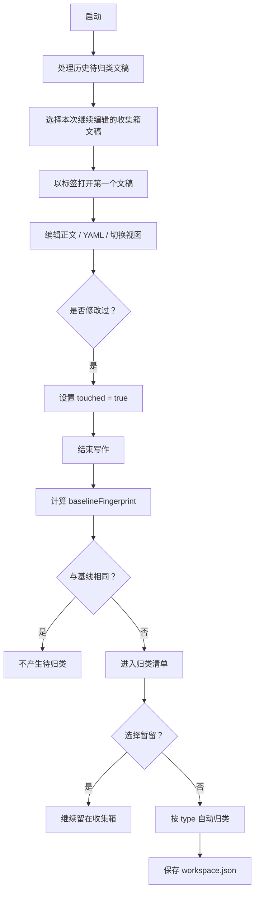

# Folio 1.4.0 技术详解文档

**版本**：1.4.0  
**生成时间**：2026年8月  
**技术方向**：详细技术架构、核心组件实现、数据模型、流程引擎

---

## 1. 整体架构概览

Folio 是一个**完全本地优先**的沉浸式 Markdown 写作台，采用**前后端分离**架构：

```
[前端 React 19 + Vite]  ↔  [后端 Node.js HTTP Server]  ↔  [本地文件系统 + JSON 存储]
```

**核心设计理念**：
- **本地优先**：无云端同步，所有数据保存在本地 `data/` 目录
- **状态机驱动**：写作过程被抽象为明确的状态机（收集箱工作流）
- **结构化优先**：通过 PARA 目录 + 稳定 ID + YAML frontmatter 实现流程控制

**技术栈**：
- **前端**：React 19 + TypeScript + Vite 8 + Tailwind
- **编辑器核心**：CodeMirror 6 + @codemirror/lang-markdown
- **渲染引擎**：highlight.js + KaTeX + Mermaid 11
- **后端**：自定义 Node.js HTTP Server（`/api/workspace`、` /api/config`）
- **状态管理**：自研 `useSyncExternalStore` + 全局工作区状态

---

## 2. 关键组件与实现细节

### 2.1 工作区管理层 (`src/lib/workspace-store/`)

这是整个应用的核心协调层。v1.5.0 起由单文件（944 行）切片化为目录结构：

```text
src/lib/workspace-store/
├── index.ts                 # 组装层：ctx 构建 + 7 slice spread + ctx.actions 回填 + useWorkspace
├── core.ts                  # state 唯一所有者（get/set/toast/persistSoon/currentSnapshot/subscribe）
├── tracking.ts              # 会话级指纹追踪
├── helpers.ts               # 纯函数层（无模块级 state）
├── types.ts                 # 类型契约（SliceContext / WorkspaceActions / ProtectedActionRef）
└── slices/
    ├── chrome.ts            # 视图/UI/密码门/YAML/rename/caret/模式循环
    ├── folders.ts           # 目录创建/重命名/删除
    ├── manage.ts            # 管理模式扁平列表/展开折叠/确认
    ├── navigation.ts        # 选择文稿/文件夹/关闭标签/双链打开
    ├── templates.ts         # 快速新建/模板两级选择/创建文稿
    ├── sheets.ts            # 文稿操作：重命名/移动/分类/软删除/星标/内容更新
    └── workflow.ts          # 结束写作/启动归类/继续编辑 + 持久化
```

每个 slice 是 `createXSlice(ctx)` 工厂，通过 `SliceContext` 依赖注入共享 state 与动作；跨族调用走 `ctx.actions.X` 延迟解析，slice 之间零循环 import。

核心能力：

- 使用 `useSyncExternalStore` 实现全局状态同步（对外 `workspace` 对象 62 方法 + `useWorkspace()`）
- 支持**快照机制**：
  - 主快照：`data/workspace.json`
  - 自动备份：`data/workspace.backup.json`
- 实现**指纹追踪**（`baselineFingerprint` + `touched` + `pendingClassification`）
- 支持**软删除**（移动到 `999-未分类` 并标记 `status: trashed`）
- 危险操作统一走 `runProtected` 密码门（chrome slice 的 `submitPassword` 验证成功后执行）

### 2.2 YAML 编辑器 (`src/components/YamlEditor.tsx`)

**核心创新**：
- **分栏双向联动**编辑器
- 左侧：结构化表单（使用 `react-hook-form` 隐式实现）
- 右侧：CodeMirror 源码编辑
- **双向同步机制**：
  - 表单修改 → 实时 `stringifyFrontmatter`
  - 源码修改 → `attrsFromYamlSource` 解析回表单
- 非法 YAML 保留上次有效值 + 红色错误提示 + 禁用保存
- 缺少必填字段时阻止切换文稿

### 2.3 双链系统 (`src/lib/wiki-scan.ts`)

**技术亮点**：
- 使用正则表达式匹配 `[[...]]`
- 实现 `collectWikiRefs`、`resolveWikiRef`、`mergeRelated`
- **稳定 ID 策略**：
  - 原始标题不可作为 ID
  - 保存时自动转换为 `{YYYYMMDD}-{type}-{4位随机字符}`
  - 界面显示当前标题
- `related` 字段自动合并稳定 ID

### 2.4 编辑器扩展 (`src/editor/` 目录)

- **Math 扩展**：`$$...$$` KaTeX 公式渲染
- **Mermaid 扩展**：安全模式下的图表渲染
- **Callout 解析**：NOTE / INFO / TIP / WARNING / ERROR / DANGER
- **超级语法**：`==` 上下标、圆圈、方框等
- **Slash 菜单**：表格尺寸、代码语言、常用块

### 2.5 模板系统 (`src/lib/templates.ts`)

- 内置 9 个 type + 11 个模板
- 模板存储在 `000-Template/` 目录下（Markdown + YAML 骨架）
- 新建流程：先选 type → 再选具体模板 → 进入收集箱

---

## 3. 核心工作流程详述（状态机）



**状态机关键状态**：
- `baselineFingerprint`：本轮编辑前的 SHA-256 指纹
- `touched`：本轮是否发生过编辑动作
- `pendingClassification`：是否仍需决定归类位置

---

## 4. 数据模型与持久化

### 4.1 前端数据模型（`src/types.ts`）

```ts
interface Workspace {
  sheets: Record<string, Sheet>;
  folders: Folder[];
  tags: Tag[];
  topics: Topic[];
  baselineFingerprint?: string;
  touched?: boolean;
  pendingClassification?: boolean;
}

interface Sheet {
  id: string;
  type: Type;
  title: string;
  created: string;
  updated: string;
  status: 'active' | 'trashed';
  related: string[]; // 稳定 ID 数组
  // ...其他字段
}
```

### 4.2 持久化层 (`src/lib/workspace-io.ts`)

- 序列化/反序列化工作区 JSON
- 支持自动备份（损坏时恢复）
- 版本兼容（`needs_migration` 字段）

---

## 5. 技术栈与依赖清单

### 5.1 依赖（`package.json`）

```json
{
  "dependencies": {
    "react": "^19.2.8",
    "react-dom": "^19.2.8",
    "@codemirror/lang-markdown": "^6.5.2",
    "@codemirror/view": "^6.43.8",
    "highlight.js": "^11.12.0",
    "katex": "^0.18.4",
    "mermaid": "^11.16.1"
  },
  "devDependencies": {
    "vite": "^5.4.0",
    "typescript": "^5.5.0",
    "oxlint": "^0.13.0"
  }
}
```

### 5.2 构建工具

- Vite 8（原生模块支持）
- Tailwind CSS（`src/index.css`）
- oxlint（TypeScript 校验）

---

## 6. 已知技术边界与未来规划

1. **尚未接入桌面壳**：当前为浏览器应用（`http://127.0.0.1:5173/`）
2. **Ctrl+N 限制**：Chrome/Edge 保留快捷键，需使用 `Alt+N` 或侧栏 `+`
3. **实体 Markdown 目录同步**：尚未实现双向同步
4. **永久删除机制**：仅实现软删除
5. **插件系统**：尚未接入
6. **主题扩展**：尚未支持自定义主题
7. **AI 文稿迁移工具**：仍在规划

